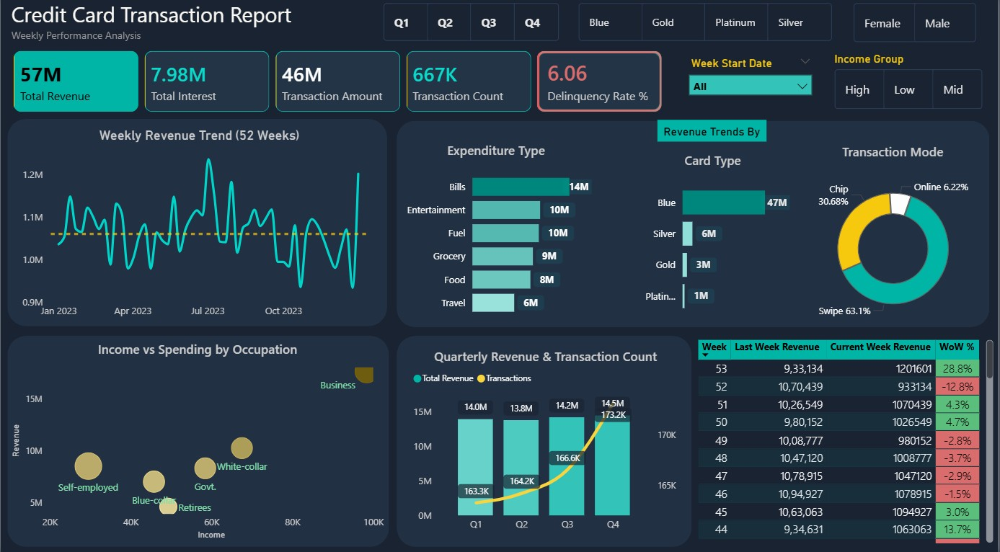
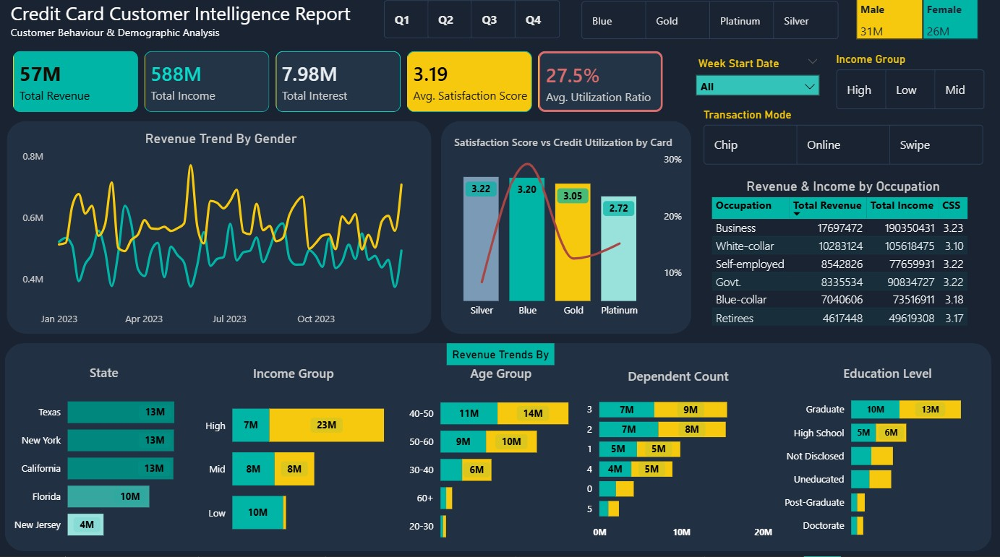

# Credit Card Financial Performance Analysis | SQL + Power BI 




## Project Overview
End-to-end financial analytics project analyzing **10,000+ credit card records** across FY 2023. Built on a PostgreSQL → Power BI pipeline with automated weekly data refresh, advanced DAX measures, and two interactive dashboards covering transaction performance and customer intelligence.

**Dataset Source:** Kaggle 

---
## Data Pipeline
```
credit_card.csv ──┐
                  ├──► PostgreSQL (cc_detail + cust_detail) ──► Power BI ──► Auto-refresh Dashboards
customer.csv ─────┘
                  
cc_add.csv ───────┐
                  ├──► COPY append ──► Power BI Refresh ──► KPIs update automatically
cust_add.csv ─────┘
```

---

## Tools & Technologies
| Layer | Tools |
|---|---|
| Database | PostgreSQL |
| Querying | SQL — JOINs, CTEs, Window Functions, Subqueries |
| Visualization | Power BI | DAX |
| Data Transformation | Power Query |


---

## Repository Structure
```
Credit-Card-Financial-Performance-Analysis/
│
├── data/
│   ├── credit_card.csv
│   ├── customer.csv
│   ├── cc_add.csv
│   └── cust_add.csv
│
├── sql/
│   └── credit_card_analysis.sql
│
├── dashboard/
│   ├── Credit_Card_Report.pbix
│   ├── dashboard1_preview.jpg
│   └── dashboard2_preview.jpg
│
├── docs/
│   └── Credit_Card_Financial_Performance_Analysis_Shubham_Kumar_Bhakta.docx
│
└── README.md
```

---

## Key Insights & Highlights
1. **Blue Card Concentration** — Blue cardholders drive 83% of total revenue (47M/57M) despite being the entry-level tier. **Strategy recommendation**: Implement Blue cardholder loyalty programs and proactive upgrade campaigns to Silver/Gold.
2. **Platinum Satisfaction Paradox** — Platinum holders report the lowest CSS score (2.72) despite paying premium fees; Gold (3.05) outperforms Platinum in satisfaction. **The business should audit Platinum benefits vs competitor offerings and conduct customer exit interviews.**
3. **Self-Employed Credit Reliance** — Scatter analysis shows Self-employed customers spend disproportionately high relative to income, i.e. revenue opportunity + portfolio risk. **Delinquency monitoring for this segment is recommended.**
4. **Digital Payment Gap** — 63% of transactions still use physical swipe; only 6.2% online, significant security and digital adoption gap. **Targeted campaigns promoting chip and online payment usage could reduce fraud risk while improving customer digital experience.** 
5. **Q3 Peak Performance** — Q3 highest revenue (14.2M, 166.6K transactions); Q4 declines despite holiday season.
6. **Graduate Segment Dominates** — Graduate customers generate 22M revenue, nearly 2x High School customers.
7. **High-Income Female Outspend** — Female customers in High income segment generate 3x the revenue of male counterparts.
8. **Pipeline Validation** — Week 53 data append updated Revenue 55M→57M and Transaction Count 656K→667K automatically confirming live refresh pipeline.


---

## Power BI Features Used
- Custom Calendar table.
- Dedicated **Key Measures** table.
- **Report-page tooltips**, hover on any bar to see weekly revenue trend for that segment.
- Conditional formatting on WoW % column (green = growth, red = decline).
- Slicer sync across Quarter, Card Category, Gender, Income Group, Transaction Mode.
- Used Power Query to automate the data pipeline.

---

## Project Documentation
Full project documentation including business requirements, all SQL queries with result screenshots, dashboard overview, and detailed insights available in:
`docs/Project_Report_Credit_Card_Financial_Performance_Analysis_Shubham_Kumar_Bhakta.docx`

---

## Connect
**Shubham Kumar Bhakta**  
[LinkedIn](https://www.linkedin.com/in/shubhambhakta/) | [GitHub](https://github.com/analyst-shubham)
